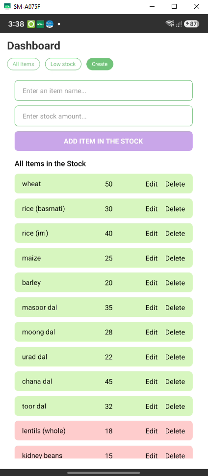

# 🛍️ Shop Management Mobile App

[](https://reactnative.dev/)
[](https://reactjs.org/)
[](https://reactnative.dev/)
[](LICENSE)

A clean, responsive, and intuitive **Shop Inventory & Stock Management** mobile application built using **React Native**. Designed to help small businesses, retail shops, and store managers track inventory levels, monitor low stock items in real-time, and seamlessly perform item management tasks.

---

## 📱 Application Preview

<div align="center">
  
</div>

---

## ✨ Key Features

- 📊 **Interactive Dashboard**: Effortlessly switch between item views with dynamic tab navigation.
- 📦 **All Items Overview**: View complete stock inventory with clear item names and quantities.
- ⚠️ **Low Stock Alert System**:
  - Automatically highlights items with low inventory (< 20 units) in red for high visibility.
  - Dedicated **Low Stock** filter view to quickly prioritize items needing reorder.
- 🛠️ **Full CRUD Operations**:
  - **Create**: Add new inventory items with custom names and initial stock levels.
  - **Read**: Live stock list rendering powered by optimized `FlatList`.
  - **Update**: Easily update item names or stock numbers in place.
  - **Delete**: Instant item removal functionality.
- ✔️ **Smart Form Validation**: Built-in validation ensuring valid item names and non-negative numeric stock quantities.
- 📱 **Cross-Platform & UX Optimized**: Includes `SafeAreaView` and `KeyboardAvoidingView` to deliver a native look and feel on both iOS and Android.

---

## 🛠️ Tech Stack & Dependencies

- **Framework**: [React Native](https://reactnative.dev/) (v0.87.1)
- **Library**: [React](https://reactjs.org/) (v19.2.3)
- **UI & Layout**: `react-native-safe-area-context`
- **Language**: JavaScript (ES6+) / TypeScript
- **Tooling & Build**: Metro Bundler, Babel, ESLint, Prettier

---

## 📁 Repository Structure

```
Shop-Management-Mobile-App/
├── assets/                  # Application media assets & screenshots
│   └── shop-app.PNG         # Main app preview screenshot
├── src/
│   ├── data/                # Initial mockup data & type definitions
│   │   └── itmesData.ts     # Sample shop items data
│   ├── screens/             # Screen components
│   │   ├── AllItemsScreen.jsx  # Main stock list screen
│   │   ├── StockScreen.jsx     # Filtered low-stock items screen
│   │   └── CreateScreen.jsx    # Add, Edit & Delete management screen
│   └── HomeScreen.jsx       # Dashboard container & tab navigation logic
├── App.jsx                  # Main entry component
├── index.js                 # App registry entry point
├── package.json             # Project dependencies and scripts
└── README.md                # Project documentation
```

---

## 🚀 Getting Started

Follow these steps to get a local copy up and running on your development machine.

### Prerequisites

Ensure you have your environment set up according to the official [React Native CLI Environment Setup](https://reactnative.dev/docs/set-up-your-environment) guide:

- **Node.js**: `>= 22.11.0`
- **npm** or **yarn**
- **Android Studio** (for Android Emulator/Device) or **Xcode** (for iOS Simulator - macOS only)

### Installation & Setup

1. **Clone the Repository**
   ```bash
   git clone https://github.com/Imtiaz-Ali17314/Shop-Management-Mobile-App.git
   cd Shop-Management-Mobile-App
   ```

2. **Install Dependencies**
   ```bash
   npm install
   ```

3. **Start the Metro Bundler**
   ```bash
   npm start
   ```

4. **Run on Android / iOS**

   - **Android**:
     ```bash
     npm run android
     ```

   - **iOS** (macOS only):
     ```bash
     cd ios && pod install && cd ..
     npm run ios
     ```

---

## 🔮 Future Improvements

- 💾 **Persistent Storage**: Integrate `@react-native-async-storage/async-storage` or SQLite/Realm for persistent local data offline.
- 🔍 **Search & Filter**: Add search bar to quickly search items by name or category.
- 📈 **Analytics & Reports**: Visual stock trends and low stock alerts via push notifications.
- 🎨 **Theme Support**: Dark mode & custom store branding options.

---

## 👨‍💻 Author

**Imtiaz Ali**
- GitHub: [@Imtiaz-Ali17314](https://github.com/Imtiaz-Ali17314)
- Portfolio / Projects: Shop Management Mobile App

---

## 📄 License

This project is licensed under the MIT License - see the [LICENSE](LICENSE) file for details.
